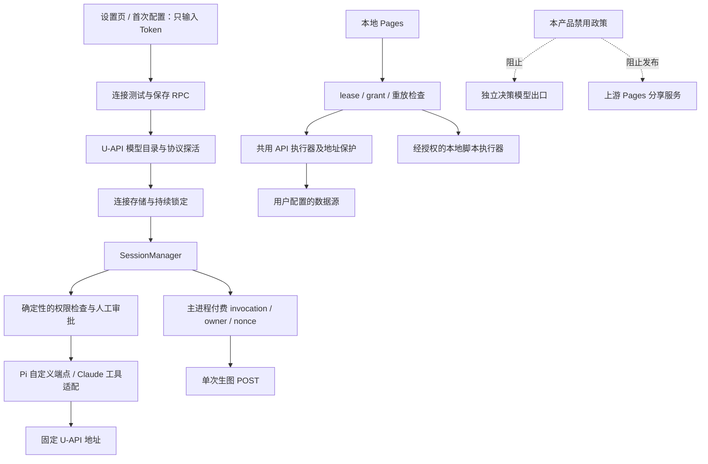

# U Agents v0.14.0 升级落地方案

> 2026-10-01。**方案阶段：未改源码、未安装依赖、未合并、未运行测试。**
> 以实际代码为依据，供后续获得代码修改授权的执行会话使用。功能取舍在本文中是建议，不代表用户已批准开放 Pages 或改变产品边界。
> 配套：[第一轮审查](UPSTREAM-REVIEW-v0.14.0-20261001.md) · [561 文件完整清单与交叉行段](UPGRADE-FILE-INVENTORY-v0.14.0-20261001.md)。
> **修订版 r2**：已按[系统评审 R1–R5](UPGRADE-PLAN-REVIEW-v0.14.0-20261001.md)修正方案要求；“文档已修订”不代表代码缺口已修复或测试已通过。

## 1. 总体决定与交付边界

**推荐一次同步到固定的 v0.14.0，在同一同步分支内分任务包完成适配。基础修复先验收，新 Pages 单独验收，最终统一出升级候选。** 不逐个发布中间的 12 个版本，也不把每个上游新增能力都作为本轮必须开放的功能。

建议的产品范围：

| 类别 | 本轮落地方式 | 用户看到的结果 |
|---|---|---|
| 权限、稳定性与中转兼容修复 | 接收并适配 | 授权更准确，停止/排队/重试更可靠 |
| U-API 连接和生图 | 保留当前合同并迁移交叉代码 | 仍只填 Token；已有模型发现、图片生成不退化 |
| 本地 Pages | 建议作为单独 Beta 交付项；首个候选限 F1 与 F2 API/MCP，验收后开放 | 本地页面、数据与已授权 API/MCP 动作；script/F3 默认关闭 |
| Pages 公开分享 | 本轮关闭发布；不建设服务端 | 没有上传至官方服务的分享入口 |
| Decision model / `decide` / Guarded | 本轮不开放；服务端强制限制 | 仍保持现有三档权限，无额外模型账户与请求 |
| 新 provider / 账号直连 | 可保留上游实现，用户入口继续锁定 | 不出现 Moonshot/OpenRouter/Copilot 等新增连接入口 |
| WhatsApp、远程浏览器等现有裁剪项 | 不因同步扩大范围 | 延续当前产品决定 |
| 公开发布 | 独立于代码候选完成 | 签名、平台实测、更新链路未过前不发布 |

本地 Pages 是否公开开放是本方案唯一主要新增产品能力。建议接收，但即使决定暂缓，也应使用完整的 UI、工具、RPC、调度与动作执行门控，不能只隐藏侧栏。这不是当前会话的代码实施授权。

## 2. 固定输入、规模和证据可信度

### 2.1 三方比较基线

| 输入 | 固定值 |
|---|---|
| 共同上游基线 B | `4289b16097322e9911d3078d8a64bd8c830717c3`（v0.11.1） |
| 本地 O | `c6cf072d5bd03fa645430d901ff5bd112b708c2f`（main） |
| 上游 T | `73bd9c2a3573158bea880984eb8d5fdb41e0cac2`（v0.14.0） |
| 最新发布复核 | GitHub latest 仍为 v0.14.0，2026-09-30 发布 |

比较 B→T 找上游新变化，比较 B→O 找本地改造，再检查同文件/同区间与调用链交叉。后续若 O 或 T 改变，必须更新对应差异，不能只改报告里的 SHA。

本地 `main...origin/main [ahead 1]` 只说明相对已缓存的远端引用；没有 fetch，不能将它表述为已核实远端 fork 的实时状态。原有 `.agents/`、`.codex/`、`manifest.json` 未跟踪，本轮未处理；不能在实施准备时用 reset/clean 一并清走。

### 2.2 规模的不同含义

| 维度 | 结果 | 用途与限制 |
|---|---:|---|
| 发布记录 | 12 次 | 不等于改动小：上游为 release squash |
| 上游变化文件 | 561（237 新增 / 322 修改 / 2 删除） | Git trees 与 tar 内容比较相符；按路径统计，不推断 rename |
| 双方均有改动 | 201 文件 | 全量人工分派清单；不是合并冲突数 |
| 同段或边界相接编辑 | 102 文件 | difflib 静态筛选，用于优先级；不是 Git 合并模拟 |
| U-API 标记交叉 | apps/packages 45 文件，另 scripts 1 文件 | marker 并不能发现未标记的新入口 |
| 当前主标记基线 | 178，START/END 各 10 | 对应 §14，仅 apps/packages TS/TSX；不包含构建脚本子表 |
| 上游新增翻译 key | 每个 locale 227 | 7 种语言都新增，无上游删除；各有 5 个改值 |
| 本地独有翻译 key | 50 | 不能用上游 locale 整份覆盖 |
| 新增版本日志文件 | 13 | 包含 `0.13.2.md`，虽未出现在本次公开 Release 列表 |

重点变化：`packages/shared` 229 文件（另计 locale 和 release-notes 分类）、server-core 78、Pi 子进程 32、session-tools-core 24、Electron 123。全量清单记录每个路径、上游状态、双方交叉、标记数与同段范围。

**审查深度**：561 文件做了清单级、内容差异与交叉扫描；对下文关键入口读取了实际函数与调用关系。没有声称逐行人工审完全部文件，没有合并试验或动态安全证明。

## 3. 当前架构与升级后必须保持的调用关系

LLM 网关限制针对模型调用，不意味着所有 Sources 都只能访问 U-API。不能为了禁止决策模型，误封用户正常授权的 API/MCP 数据源；也不能把数据源授权当作绕过模型入口政策的许可。

## 4. 多维差异与具体改造设计

### A. 网关、模型目录与连接生命周期

**实际本地合同**：`u-api-defaults.ts:isUApiSlug()` 接受 `u-api-default`、`u-api`、`u-api-N`。首次配置和设置页新增连接只填 Token；`discoverUApiModels()` 固定 GET `/v1/models`、禁止重定向；`selectWorkingUApiModel()` 依候选与协议探活。`model-fetchers/index.ts:_doRefresh()` 有 U-API 专用刷新分支，不能被上游“普通兼容端点不刷新”逻辑吞掉。

上游新增 `resolveSetupTestApiKey()` / `maskApiKey()` / `isMaskedApiKey()`，修复编辑连接时把掩码当凭证；连接测试 DTO 增加 `connectionSlug`。这段与我方发现/探活分支相邻。

落地要求：

1. 先在主进程校验产品允许的连接种类和固定目的地，再解析新输入或现有凭证。U-API 发现与探活由服务端构造固定 `U_API_BASE_URL` 和允许的路由；调用方不能用 `baseUrl/provider/customEndpoint` 把存储密钥带入通用外部测试分支。提供 `connectionSlug` 时必须既匹配合法命名又实际存在；新建流程不提供 slug 时只接受新输入 Token。外部地址、loopback、非允许 provider、掩码但缺失连接等禁止组合，在读取存储凭证前拒绝且零网络请求。正常编辑才按该连接读取密钥；不得把掩码发给网关或把明文返回 renderer。此约束适用于 `TEST_LLM_CONNECTION_SETUP`，不能依赖之后 SAVE/启动的归一化。
2. 保留 `enforceUApiBaseUrl()` 的启动与写入归一顺序，先归一 U-API，再执行上游模型迁移；不能用新 Fable/Kimi 默认列表改写 Token-scoped ID。
3. `resolveUApiRefreshSelection()` 延续当前推荐规则：默认值等于旧目录首项时跟随新推荐；非首项且仍可用时保留；消失则回到有效推荐。保留仍兼容的协议。现有规则无法区分“用户主动选首项”和“自动选首项”，本轮不增加选择来源字段。刷新失败不能清空目录或切成官方账号连接。**代码差异 / TODO**：当前刷新把 models 简化为 ID，并重建 `customEndpoint.supportsImages=true`，并未完整保留图片能力覆盖值；下述能力合并是建议修复已有缺口，不是宣称现有实现已经满足。
4. `SAVE → refreshConnectionRuntime()` 的主动推送、发送前能力校验和惰性刷新继续存在；不能让图片能力关闭后仍向不支持图片的模型发送附件。
5. 接收上游 `buildCustomEndpointModelDef(..., api)` 的 `supportsStore=false`，同时检查所有调用点传协议。不可只搬函数内部一行，也不可改变自定义端点图片/推理/上下文容量的现有语义。
6. 普通聊天重试与模型发现错误分类分开：发现阶段的 401/403/429/余额错误不能用换模型掩盖；SDK 流式重试按其明确预算和停止信号处理，不继承为生图重试。

能力合并规则：同一连接中，按仍在新有效目录内的 model ID 保留已有显式 `supportsImages`（含 false）；新模型无旧覆盖时用发现/现行默认值，不复制其他模型的设置。连接级显式图片开关也保留，不被 selection 的默认 true 覆盖；其最终优先级沿用现有 `modelSupportsImages`，不另创优先级。退出目录的模型不继续作为可选项，其旧设置只留在升级前备份，不另建历史设置库。协议变化时只迁移协议无关的图片开关，路由、认证类型及协议专属参数按新协议重建；原始备份不改。通过发现→写入→runtime 推送→重启的整链测试证明生效，不能只测选择函数。

主要文件：`server-core/src/domain/{u-api-model-discovery,connection-setup-logic}.ts`、`handlers/rpc/llm-connections.ts`、`model-fetchers/index.ts`、`shared/src/config/{storage,llm-connections,u-api-defaults}.ts`、`pi-agent-server/src/{index,custom-endpoint-models}.ts`、`ApiKeyInput.tsx`、`useOnboarding.ts`、`AiSettingsPage.tsx`、`shared/src/protocol/dto.ts`。

### B. 权限与管理员审批

本地 `pre-tool-use.ts` 仍按首词检查命令白名单；本地 `SessionManager.onSpawnSession` 直接采用请求权限。上游提供 `permission-remember.ts`、`clampPermissionMode()`、MCP 只读判断与 Pi 无人应答拒绝，均有直接接收价值。

合并应贯穿以下链路：

`命令/工具分类 → PromptInfo.remember → 权限请求 DTO/事件 → 用户答案 → PermissionManager.remember → 后续同键检查`。

不能保留旧“从提示文本再取首词”的应答处理。`source-policy.ts` 是上游新增共享判断，需与 `mode-manager.ts`、`bash-validator.ts`、`permissions-config.ts` 和 Pages 动作一起接收。完整接收只读工具判定，验证 `delete_account`、`send_thread_reply` 等不能因为名称中包含读动词被放行。

我方 `classifyAdminApproval()`、`admin_approval`、`privileged-execution-broker.ts` 的命令摘要/过期/策略绑定必须保留。权限白名单不能绕过管理员审批，也不能把新上游普通确认误当系统管理员授权。

`clampPermissionMode()` 解决的是子会话上限；任务板 TaskRunner 的默认权限与自动化入口仍需单独核对，不把“一个入口已 clamp”写成全平台权限已统一。

### C. 决策模型禁用与旧模式兼容

上游决策模型走 `/v1/systemone`，配置、凭证、测试与健康探测均独立于 `llmConnections`。在 `status.ts:testDecisionConnection()` 中 `skipGates=true`，所以“总开关默认 false”不足以落实我方限制。

建议新增一个小型、浏览器安全的产品政策模块（**拟新增文件** `packages/shared/src/config/u-agents-feature-policy.ts`），只表达固定的 `decisionLayerAllowed=false` 与 `pagesPublishingAllowed=false` 等本轮必要边界。名称是方案建议，不是现有符号。避免把判断散在每个 UI，也不建设通用策略平台。

政策必须接到四层：

| 层 | 改造点 | 禁用时行为 |
|---|---|---|
| 设置读取与修改 | `getDecisionLayerSettings`、`setDecisionLayerSettings`、decisions RPC | 返回有效禁用状态；拒绝启用，不删除原始未知配置 |
| 网络解析与测试 | `resolveDecisionClient`、`testDecisionConnection`、probe | 产品政策先于 `skipGates`；拒绝且零网络请求 |
| 工具与宿主调用 | `getSessionToolDefs`、Claude/Pi 注册、server-core decisions callbacks | 不展示 `decide`；陈旧调用明确不可用 |
| 权限模式 | `resolveEffectivePermissionMode`、可选模式、恢复会话 | `guarded` 输入按 ask 有效执行；UI 不显示它为可选新模式 |

保留上游类型和不会运行的模块可降低同步成本；不要因关闭一项功能大面积删类型。决策开关不写入由用户环境变量开启的后门。

**Guarded 特别说明**：未激活时退回 ask；已激活的单次检查 null/抛错则可能返回原允许结果。这里是实际实现语义，不能在文案里承诺“判断服务出错必询问”。

**语义条件特别说明**：`checkAutomationCondition()` 在功能关闭、不可用或失败时返回 null，宿主按无条件继续。对本产品不支持的 `semanticCondition`，保存/导入时明确提示不支持，调度前再次拦截该次运行并记原因；不要删除条件后执行，也不要破坏原配置。没有语义条件的现有自动化正常运行。语义标签不触发推理、不自动打标签；任务判断继续走文本 `VERDICT` 和原有有限重问逻辑，不能静默判成功。

### D. 会话、重试与付费生图

`SessionManager.ts` 在三方同段扫描中有 21 处交叉，是本轮最重要的逐段审查文件。上游新增隐藏 source retry、携带 steers 的 `buildActivationRetryMessage()`、合并重放消息 ID、`turnContext` 与普通流式 retry discard 边界；我方同区域保存计费上下文。

合并映射：

| 生命周期 | 本地必须保留 | 上游变化如何接入 |
|---|---|---|
| 普通顶层用户消息 | 持久化 Message.id 后创建私有 invocation | 新排队/合并机制不得凭一段文本创建收费授权 |
| 用户中途纠正 | 立即失效当前付费能力 | 即使上游保留 steers 供文本重试，也不能复活旧生图授权 |
| source activation | 受信 pending record 精确绑定身份 | 兼容 plain/retry 文本两种去重形式，沿用原 ID/nonce，不按 suffix 授权 |
| auth retry / agent 重建 | 原上下文延续与 owner compare-delete | 新 replay IDs 不能形成第二个收费窗口 |
| Stop / destroy | `terminatePaidImageInvocation()`、释放旧 owner | 上游取消与异常返回都必须经过同一终止路径 |
| claim 后失败 | `possibly_charged`，不自动第二次 POST | 普通模型重试机制不得包裹图片 operation |
| runtime 私密字段 | 落盘前 redaction | 新 `turnContext`、事件和工具结果序列化都要查 nonce/lease 泄漏 |

本地代码只将来源折叠为 `interactive | internal`，不能按旧规格中的四类 origin 虚构现有枚举；Messaging/Automation/无可信 RPC 的调用必须保持 internal 语义。

工具合并同时保留 `SessionToolFilterOptions.surface/agentKind`、`generate_image.availability`，再加入上游 `includeDecide`。Claude 的 cache key 当前包含 `agentKind + ownerCacheKey`，上游只有 `sessionId + workspaceRootPath`，不能回退。Pi 的 `getSessionToolProxyDefs(agentKind)` 参数也不能被上游无参数调用覆盖。

`paid-image-tool-registry.ts` 使用 canonical session path 与 owner 隔离。已有测试只有旧 owner/compare-delete 等覆盖；补上 16B 已登记缺口：不同 canonical workspace/session path 不能共用 callback。测试断言零额外 POST，而不是只断言出现错误文字。

### E. API、MCP、OAuth 与网络保护迁移

这是本轮新增的明确整合风险：上游 `api-tools.ts:executeApiRequest()` 是聊天 API 工具和 Pages 的共用请求层，当前上游函数直接 `fetch(url, fetchOptions)`；我方保护位于旧 `createApiTool()` 内。

**落地设计**：将我方 `assertPublicHttpsUrl()`、`redirect:'manual'`、30x 拒绝迁入最终 URL 已构建、fetch 尚未执行的共用层。保持上游 `ApiRequestOutcome` 正常返回合同，安全拒绝以明确异常/结果让聊天工具与 Pages 分别显示；避免下层返回旧 ToolResult 导致 Pages 类型不匹配。续期地址仍由 `credential-manager.ts` 的既有保护负责，不能因主请求安全而删除它。

共同层保留上游 signal/timeout、凭证按请求懒读取、header names 而非 values 日志、query-auth URL 脱敏与响应大小检查。记录现有地址保护的能力边界，不把它包装成已解决所有 DNS rebinding 或全流式内存风险；本轮不借机重写完整网络框架。

上游鉴权解析抽到 `session-tools-core/src/api-auth.ts`，source_test 与真正请求共用编码。整合我方 source_test 的 SSRF 检查，覆盖 Bearer、单 header、多 header、Basic、OAuth 刷新；通过 source_test 必须与真实请求装配一致。

MCP OAuth 增加 resource 参数与发现流程，涉及 `auth/oauth.ts`、credential-manager。第三方 Sources OAuth 允许按既有产品边界工作，不能同“官方模型账号直连”一起禁掉。

OAuth relay 在本次也迁到 `thecraftagents.com`；Slack 使用专用 `/auth/slack/callback`，不是通用 `/auth/callback`。**不能全局替换为我方域名**，否则破坏服务商已注册回调。保留必要 relay，完成登录实测后更新 LEGAL 的已知外部域名说明；不顺手建设自有 OAuth 服务。

### F. 本地 Pages：存储、动作、刷新与分享分层

上游页面目录为 `<workspace>/pages/<slug>/`。配置 `page.json` 和内容 `index.html` 由 host 管理；数据层含 `data/store.sqlite` 与 `data/snapshot.json`，host 展示读取 snapshot，刷新脚本写数据。不能将其当作可以随意删除的预览缓存。

推荐拆成三个验收层：

| 层 | 范围 | 必须证明 |
|---|---|---|
| F1 展示与数据 | CRUD、项目绑定、页面预览、KV/时序、缩略图 | 不越目录、重启保留、删除范围正确、渲染无凭证 |
| F2 授权动作 | 首个候选仅 API/MCP、source 重连、lease/grant/replay | HTML 变化失效授权，过期/跨页面/重放被拒，写动作需真实用户交互；script 后端拒绝 |
| F3 定时刷新 | 首个候选关闭 Pages cron → ScriptAction | 新增/导入/旧配置均不注册刷新任务；拒绝原因可见；原配置与数据保留 |

PageFrame 的静态页不启用脚本，interactive/live 仅 `allow-scripts allow-forms`，不放开 `allow-same-origin`。保持宿主来源校验、用户激活证明和 rate limit，不把“有 grant”当作任意请求可执行。

脚本执行器 `executeScriptAction()` 使用 argv spawn、工作区内路径检查（含符号链接）、有限环境变量和 TERM→KILL 超时。**这不是操作系统沙箱**：限制入口脚本路径不等于脚本无法访问外部文件或网络。`contentDigest` 绑定 index.html，不包含入口脚本及其依赖；改同路径脚本不会因此自动使 grant 失效。

本修订建议首个候选关闭 Pages 的 F2 script 和 F3，不扩大为关闭原有普通 Automations。执行时将 Pages script/refresh 固定产品政策接到 grant 签发、工具/RPC 保存与执行、broker、刷新任务注册/重载/触发处；陈旧 grant/已排队任务也不得启动进程。保留已存配置与数据，读取时显示不可用原因，不删除旧脚本或条件。该建议是明确的候选默认范围，仍不代表本次已实施或已授权公开开放 Pages。

以后若开放，须单独明确授权的是“可变路径能力”还是“固定脚本版本”；若选后者，依赖文件也需纳入设计，不能只 hash 入口文件便声称安全。对应验收另含：改脚本不改 HTML、依赖变更、无页面打开时刷新、禁用后的下一次调度，以及路径逃逸、超时终止、失败可见。当前只验收关闭链路，不把上述开放态测试记为通过。

`buildBaseScriptEnv()` 的 `CRAFT_*` 是上游脚本数据合同。品牌适配时先区分用户可见文案与内部协议，不全局改名造成刷新脚本找不到数据；同时确认环境中没有 U-API Token 和正式凭证路径泄漏。

公开分享隔离措施：

- 固定产品政策禁止 publish/republish/password 修改，`GET_SHARE_CAPABILITIES` 返回 false。
- `PagePublisher` 自身执行前拦截，RPC/工具不能绕过 UI；改 `VIEWER_URL` 无法影响独立的分享 API 常量。
- 不安装或部署不存在的 `workers/pages`；上游脚本跳过该目录只能记为 OSS 不含服务端，不能算分享验收通过。
- 已有 share 指针不自动上传、覆盖、取消或删除。用户明确撤回时保留撤回路径；缺管理 token 的 `remote-copy-may-remain` 必须原样解释，不能声称远端删除成功。
- 删除带公开副本的旧页面要明确是否仍有远端副本，不能利用“分享已关”静默遗失撤回信息。

### G. 数据目录、凭证与回退兼容

上游统一 `resolveConfigDir()`，我方优先级必须保持：非空 `U_AGENTS_CONFIG_DIR` → 兼容 `CRAFT_CONFIG_DIR` → `~/.u-agents`。空白值的行为需用测试固定，不能令新版落入不同目录。

一起核查：`paths.ts`、`interceptor-common.ts`、`config-validate.ts`、secure-storage、main logger/window-state、锁文件、workspace 路径、preload 引导以及子进程继承环境。尤其不能让配置使用隔离目录而 `credentials.enc` 仍读正式目录。

旧数据兼容 fixtures 至少包含：v0.11.1 多连接、主连接、用户默认模型、文件附件、会话状态、项目、Tasks、Sources/OAuth 引用、自动化、中文设置和手动下载配置。新版本不得为通过 schema 校验删除未知字段、旧会话或凭证。

**W0 演练准备必须区分原样备份与运行副本**：停机备份保持原内容与凭证权限，仅用于恢复；运行副本使用脱敏数据与假凭证，在首次启动前完成以下检查：

- 列出并重映射 `config.workspaces[].rootPath`、session workingDirectory、附件、脚本及 Sources 文件引用；展开 `~`/变量并解析符号链接后校验允许路径。无法安全映射的引用标为不可用，不能静默回落到正式路径。
- 正式目录不在演练进程可写集合，凭证库不得回落正式位置；通过隔离账户/受控环境或等效限制保证，单设 `U_AGENTS_CONFIG_DIR` 不算完成。产品仍支持外置 workspace，演练副本可位于多个明确允许的根，不强制迁入 config 根。
- 首次演练不运行既有自动化、Tasks、Messaging 后台动作或 Pages 刷新；外发由测试环境阻断/mock，不接真实凭证。检查调度恢复时只在专门 fixture 中启用。脚本可访问其路径之外，路径重映射不能替代执行隔离。
- 启动前故意加入指向正式根的错误配置，必须被预检拒绝；记录正式目录内容清单，演练后核对无变更并核对网络请求。没有上述运行条件则不启动候选，只继续静态核对。

Pages 的新目录、guarded/decisionLayer、新任务字段和自动化条件会影响降级读取。没有新旧双向 fixture 前，不能保证“装回旧包即可恢复”。回退使用同一时点的安装包与停机备份，在隔离副本上验证；升级后新产生的会话/Pages 先保留，不能覆盖掉。

### H. SDK、构建与更新链路

依赖目标：Claude SDK `0.3.197 → 0.3.280`；Pi 系列 `0.80.6 → 0.87.1`。保持各包版本一致、`@u-agents/*` scope 与我方现有 overrides，下游实际 lock 解析另验。上游较宽的 `linkify-it` / `shell-quote` 范围不能覆盖我方下限。

已确认构建连锁：

`build-dmg.sh` 先调用 `electron:build`（其中包含 `electron-build-main.ts`），成功后另行调用 `copy-subprocess-servers.ts`；copier 不是 main 构建脚本的子调用。

`build-win.ps1 → server:build:subprocess → copy-subprocess-servers.ts + 独立 interceptor 构建`

上游取消 session MCP 构建，`runtime-resolver.ts` 也移除了 session/bridge path；我方 copier 仍在找不到 `packages/session-mcp-server/dist/index.js` 时抛错。若只接收前半部分，干净打包必然卡住，旧 dist 可能掩盖。

**推荐联动收敛**：先核对最终 Claude/Pi 工具调用确实走宿主注册（包括 generate_image），然后同一任务包接收上游取消旧 session/bridge bundle、移除我方对应 copy/必备资源检查，并同步 dmg/win 文案与构建图。不要删 `session-tools-core`，也不扩大成删除整个历史 session-mcp-server 源码包。若最终 fork 尚有实际运行时消费者，就保留其 build+copy 完整链，列出调用证据后再决定，不允许“可选 warning”掩盖缺产物。

必须继续打入 Pi bundle、目标架构 Bun、uv、所需 koffi、interceptor、文档工具、许可证和通知。当前 copier 只判断 bun 文件存在并按主机架构工作，因此不能把 arm64 主机缓存用于 x64 安装包验收；按目标架构分开构建/检查。

自动更新接收 `setBeforeUpdateInstallHook()` / `setInstallQuitFailedHook()` 与主进程清理/重启联动，保持自有 feed、appId、安装包名和手动下载。旧包能否发现并安装新包也要验证，不能只在新版点“检查更新”。不得发布上游安装包来跨过我方更新链路。

### I. 中文、品牌、文档与功能承诺

7 个 locale：本地 1686 key，上游目标 1866；上游相对 B 新增 227，当前本地相对目标独有 50。不能直接做 `1686 + 227` 作为最终 key 数；上游集合与本地集合的交集不同。保留我方改名/新增 key，适配调用点后再以实际 parity 为准。

新增 key 主要分布：Pages 82、settings 85、chat 22、toast 17、rtkUpdate 11。禁用决策模型不意味着可直接删其 locale key；保留上游类型/组件时仍可能被静态 coverage 扫到，需按最终引用决定。

品牌扫描补充 `thecraftagents.com`、官方 npm scope、新 provider attribution；按场景处理：

| 场景 | 处理 |
|---|---|
| 用户界面、生成文本、help/下载/更新 URL | 改为我方已存在且验证过的地址或明确不可用 |
| LLM 连接 UI | 使用 U-API，不混成 U Agents |
| 第三方 Sources OAuth relay | 保留可工作回调并披露，不机械替域名 |
| LICENSE / NOTICE / TRADEMARK | 保留上游证据，不清洗原始版权 |
| 内部 `CRAFT_*` 数据合同或类型名 | 逐项评估兼容，不为品牌统一破坏协议 |

13 份新增版本日志逐份中文化，包括 `0.13.2.md`；`next.md` 接收上游版本文件过滤，不能展示成一个版本。最终日志只宣传我方开放且验收通过的功能。

需在实施完成后更新的规格：01 品牌、02 网关/新出口限制、04 功能裁剪、05 构建、09 验收、10 翻译、12 构建图、14 标记及 16B 生命周期对照。旧文档“协议可手选”“只有 6 locales”“llm-connections 理论上无改造”“固定 4 处 craft.do”不能当作现行验收事实；按实际代码逐项修订，不全仓重写文档。

## 5. 实施任务包、依赖与完成证据

建议在一个同步分支中形成下列可审查提交；没有要求创建多个会话或并行 agent。上游大 merge 本身可能先有一批冲突，工作包用于安排解决与验证顺序，不保证每个中间提交都能独立发布。

| 包 | 内容与主要写集 | 前置 | 完成证据 |
|---|---|---|---|
| W0 固定现场 | 基线、未跟踪项归属、原样备份及脱敏重映射副本 | 用户授权执行后 | 三个 SHA、路径映射、恢复材料、启动隔离预检；不自动清理 |
| W1 集成准备与收口 | manifests/lock、scope、类型出口、完整冲突映射；W2–W7 纳入同一集成范围 | W0；准备先行，收口依赖 W2–W7 适配 | 准备完成仅代表清单与设计齐备；收口才要求冲突清零、锁可复现、政策到位 |
| W2 网关与产品政策 | A/C；storage、RPC、模型发现、UI、decisions、分享及 Pages script/refresh policy | W1 准备 | 测试目的地与凭证绑定；篡改配置/直调 RPC 外发负例为零请求 |
| W3 权限与网络保护 | B/E；pre-tool-use、mode、remember、API 共用层、renew/source_test | W2 | 授权范围、SSRF/重定向、凭证装配测试通过 |
| W4 会话与收费工具 | D；SessionManager、Claude/Pi、工具过滤/cache/owner、事件适配 | W2/W3 | 生命周期 mock POST 计数、redaction、恢复/取消/steer 通过 |
| W5 数据与自动化 | G；配置根、credential、Tasks、automation、semantic unsupported | W2/W4 | 旧数据迁移副本对照，带不支持条件不运行，无条件任务不退化 |
| W6 本地 Pages | F；Pages UI/存储/工具/RPC/broker；script/刷新关闭 | W3/W5 | F1/F2 API/MCP 验收；script/F3/分享关闭的负例通过；不以 Beta 豁免 |
| W7 构建与更新 | H；dmg/win、copier、builder、runtime、auto-update | W4/W5，最终包括 W6 | 干净构建资源清单、目标架构、旧→新升级与失败恢复证据 |
| W8 中文与审计收尾 | I；7 locales、13 日志、规格/marker | 最终源码范围确定 | parity/sorted/coverage、截图、marker 增减解释、已知问题清单 |
| W9 候选验收 | 完整自动化与装机验收 | W0–W8 | 固定候选 SHA、平台证据、未通过项，不自动发布 |

实施顺序：**W0 → W1 准备 → W2/W3/W4/W5/W6/W7 模块适配 → W1 集成收口 → W8 → W9**。这是一个集成工作范围，不要求先做未经审查的临时冲突取舍再逐提交修正；真实 merge 结束前，关键冲突必须已经按对应模块设计解决。W7 的依赖/构建静态核查在 W1 准备时开始，必要资源适配后尽早做隔离干净构建，不等 Pages 行为验收结束才发现链路问题；最终安装包仍基于 W8 后同一候选提交。

**首次应用启动门槛**：W0 隔离预检，以及 W2 产品政策/固定出口、W3 网络与权限保护、W4 付费隔离、W5 配置根与后台启动控制已经通过针对性 mock/fixture 测试。此前只允许不加载正式配置、无外发的静态检查/受控测试与构建，不启动应用做迁移。真实数据运行须等 W9 的演练与恢复证据完备。本地 Pages 若暂缓，W6 改为全链路关闭与兼容测试，不跳过后端政策验收。

对高冲突文件不使用整目录 ours/theirs 决策。特别是 storage、SessionManager、tool-defs、api-tools、paths 和构建入口，需要逐段映射“本地合同 → 上游新位置”，审查表记录新位置与对应测试。

## 6. 验收矩阵：通过必须有证据

以下均为待执行用例。mock 网络调用计数、隔离目录与固定 fixture 优先；需要真实收费、OAuth 登录或安装时另行安排明确验收窗口。

| ID | 场景 | 明确通过条件 |
|---|---|---|
| G01 | 新装只填 Token | 无 provider/baseUrl/手填协议入口；发现与探活后才能保存可用连接 |
| G02 | 编辑已有连接不重输 Token | 合法且存在的 slug；仅向服务端固定目的地测试，掩码不出网，renderer 不获得明文 |
| G03 | 旧多连接与用户默认模型 | 三类 slug 保留；首项跟随推荐，非首项仍可用则保留，消失则选有效推荐 |
| G04 | 篡改 baseUrl/provider | 保存/重启归一；测试 RPC 对外部/loopback/非允许 provider/缺失连接组合，在取存储密钥前拒绝，零外发 |
| G05 | 探活错误分类 | 允许的模型不可用错误才降级；401/403/429/余额等不换模型掩盖 |
| G06 | 协议与刷新后的图片能力 | OpenAI 不带 store；Anthropic 正常；按 A 的能力合并规则验证刷新、推送、重启、协议切换，含显式 false |
| G07 | 决策设置/测试/probe/陈旧 decide | 即使提供 enabled=true、custom URL、skipGates 场景，产品政策阻止，零外发 |
| P01 | Always Allow Git 子命令 | 批准 commit 不批准 push/reset；复合命令不得借白名单绕过 |
| P02 | runner、curl 多目标 | runner 参数变化不误复用；所有目标主机受检查 |
| P03 | MCP 名称与 shell 只读 | 读工具免提示；delete/send/update 及隐式 POST/写文件命令不能当只读 |
| P04 | 子会话与无人应答 | 子会话不高于父级；Pi 所需确认无人处理则拒绝 |
| P05 | 管理员审批 | 非匹配命令/过期审批拒绝；新普通授权键不绕过它 |
| P06 | 配置/旧会话 guarded | 有效模式为 ask；界面与实际行为一致 |
| L01 | 全新收费 invocation | 一个可接受图片 operation POST，重复调用不增加 |
| L02 | queue / steer / source retry | 每条用户消息身份清晰；steer 后旧收费能力失效；重试沿用可信身份 |
| L03 | auth retry / agent owner 替换 | 不生成第二收费窗口；旧 owner 不能删新 callback |
| L04 | Stop 前后与网络失败 | preflight 前零 POST；claimed 后返回 possibly_charged，零自动重发 |
| L05 | 新进程/旧 nonce/跨 workspace | 陈旧或跨路径 callback 不执行；内部、mini、Messaging/Automation 不执行 |
| L06 | 工具结果与落盘 | nonce/lease/owner 不进持久化、日志或 renderer DTO；错误卡和降级提示正确 |
| S01 | 聊天 API 和 Pages API 地址 | 两条入口都拒绝既有地址保护禁止的目标；不是只测旧 wrapper |
| S02 | 公开地址重定向私网 | manual redirect 并拒绝，凭证不发到第二目标 |
| S03 | Source 鉴权 | header/basic/oauth 编码与 source_test 一致；错误状态不被假报成功 |
| S04 | 续期和 Sources OAuth | 续期保留 SSRF；resource-bound MCP 与 Slack 专用回调分别验收 |
| S05 | 日志与 TLS | 请求凭证/query token 不入日志；既有严格 TLS 不回退 |
| D01 | 隔离运行副本 | 各可写路径属于副本允许集合，外置 workspace 正常；故意残留正式路径的预检失败；不读正式凭证/不执行后台任务，正式目录无变更 |
| D02 | 旧数据升级与重启 | 连接、会话、项目、任务、来源、自动化、附件引用无丢失 |
| D03 | 语义自动化禁用 | 带 semanticCondition 明确不可运行且原配置保留；普通条件照常 |
| D04 | 任务验收与重试预算 | 缺 VERDICT 有限重问，耗尽明确失败；不能因关闭决策模型默认通过 |
| F01 | 页面 CRUD/数据重启 | 页面与数据保持，非法 slug/路径拒绝，无跨页面删除 |
| F02 | iframe 与桥接 | 无 same-origin 放宽、无凭证暴露、来源/nonce/真实交互校验生效 |
| F03 | grant / lease | HTML 变化、过期、撤回、错页面、重放、频率超限被拒；不声称脚本内容受 HTML 摘要绑定 |
| F04 | Pages script/刷新关闭 | 新建/导入/旧配置、陈旧 grant、重载/已排队任务均不能 spawn；零进程启动，原配置保留并显示原因；普通 Automations 不退化 |
| F05 | 分享关闭 | UI 隐藏、RPC/publisher 拒绝、环境变量不能启用；发布零网络 |
| F06 | 历史公开副本 | 未主动外发；用户撤回区分远端成功与只清本地；删除前不丢撤回信息 |
| B01 | 干净构建 | 无历史 dist/resources 依赖；删除旧 helper 后 copier 不再索要已移除产物 |
| B02 | 安装包资源 | Pi/Bun/uv/koffi/interceptor/工具/许可证齐全且匹配目标架构 |
| B03 | 安装包实际执行 | U-API 首次对话、普通工具与受控生图链真实经过 packaged subprocess |
| B04 | 旧→新自动更新 | 自有 feed，旧包发现新版本、保存会话、安装并重新启动；失败可恢复 |
| B05 | 手动更新 | 同版本和下载失败时仍能打开我方手动下载入口 |
| I01 | 7 语言集合与引用 | parity、sorted、coverage 通过，保留本地独有 key |
| I02 | 中文页面和日志 | 13 日志及新增页面无误宣传；next 不作为版本展示 |
| I03 | 品牌和合同 | 新域名/scope 检查逐项分类，法律署名与 OAuth 例外不误删 |

运行时负例用于 mock/临时 fixtures，不对真实账号执行 delete/send/publish 等破坏动作。grep 和类型检查不能代替矩阵里的行为证据。

### 6.1 现成测试入口与需补的缺口

可以沿用的本地测试（路径以当前 HEAD 已核实存在为准）：

- `packages/server-core/src/domain/u-api-model-discovery.test.ts`
- `packages/server-core/src/sessions/{paid-image-lifecycle,paid-image-redaction,refresh-connection-runtime,source-activated-auto-retry}.test.ts`
- `packages/server-core/src/services/u-api-image-generation.test.ts`
- `packages/session-tools-core/src/{generate-image-contract,tool-defs-filtering}.test.ts`
- `packages/shared/src/agent/__tests__/paid-image-tool-registry.test.ts`
- `packages/shared/src/sources/__tests__/{api-tools-ssrf,credential-manager-renew,api-tools-credential-freshness}.test.ts`
- `packages/shared/src/credentials/__tests__/secure-storage-config-dir.test.ts`
- `packages/pi-agent-server/src/tools/web-fetch-ssrf.test.ts`
- `apps/electron/src/renderer/lib/manual-update.test.ts`

上游新增必须接收/适配的代表测试：`permission-remember.test.ts`、`clamp-permission-mode.test.ts`、`pi-retry-streaming.test.ts`、`turn-context.test.ts`、`session-settings.test.ts`、`ephemeral-query-lifecycle.test.ts`、Pages broker/RPC/script 相关测试。精确路径见全量文件清单。

需要我方补测的主要缺口：产品政策在 skipGates/probe 的零网络拒绝；API 共用层同时保护聊天与 Pages；收费 callback 跨 canonical workspace 隔离；新的 plain/retry 去重与付费身份组合；guarded/semantic 配置输入；干净构建不依赖 session MCP 缓存。

### 6.2 命令与证据口径

执行阶段仍只用 Bun。按合并后脚本先完成锁文件可复现检查，再跑针对性测试、`bun run typecheck:all`、`bun run validate:ci`、适用 lint 和完整仓库测试；当前 `validate:ci` 不等于跑过全部 session/Pages/收费工具测试。

运行完整测试应在无历史安装包副本的隔离构建目录执行，避免 `release/` 被测试发现机制重复扫描；不能用随意排除失败测试、放大超时或重复重试来获得绿色结果。上游与 fork 的失败要分别定位，不能只标成“上游已有”就免除候选门禁。

每条证据记录：候选 SHA、命令/测试 ID、平台架构、隔离配置目录、结果/退出码、日志位置、未跑原因。真实密钥不进入报告。需要修复后的重测与先前失败都保留，不只保留最后一次绿色。

### 6.3 R1–R5 的执行验证映射

下表为后续执行要求，未运行。“拟新增”路径不存在，不可把文件尚未创建记为测试通过。所有命令在仓库根、W0 受控测试环境中执行，禁止读取正式配置。mock 应在模块初始化前装配，不能先导入会初始化正式配置的模块再改环境变量。

| 评审项 / 用例 | 测试文件与命令 | fixture / 关键断言 | 证据 |
|---|---|---|---|
| R1 / G02、G04 | 拟新增 `packages/server-core/src/handlers/rpc/llm-connections-uapi-policy.test.ts`；`bun test ./packages/server-core/src/handlers/rpc/llm-connections-uapi-policy.test.ts` | 注册真实 RPC handler，mock credential 与 backend；合法三类 slug×目的地/provider/掩码组合；拒绝组合凭证读取与网络调用均为 0，正常编辑只达固定网关 | 测试逐例结果及调用计数 |
| R2 / D01 | 拟新增 `packages/server-core/src/sessions/upgrade-isolation.test.ts`；`bun test ./packages/server-core/src/sessions/upgrade-isolation.test.ts`；沿用 `bun test ./packages/shared/src/credentials/__tests__/secure-storage-config-dir.test.ts` | “模拟正式根”和副本均用临时目录，构造残留绝对路径、符号链接、外置 workspace、后台任务；预检拒绝越界，启动后无后台执行/外发/正式根改写 | 路径映射、启动前后内容清单、拒绝结果；真实演练另保留 W0 环境隔离记录 |
| R3 / G03、G06 | `bun test ./packages/server-core/src/domain/u-api-model-discovery.test.ts`；拟新增 `packages/server-core/src/model-fetchers/u-api-refresh-preservation.test.ts` 并用 `bun test` 执行该路径；沿用 `bun test ./packages/shared/src/config/__tests__/model-supports-images.test.ts ./packages/server-core/src/sessions/refresh-connection-runtime.test.ts` | 首项/非首项/消失模型、逐模型与连接级 false、协议切换；覆盖实际刷新写入及重载，runtime 能力与保存结果一致 | 旧→新模型与能力预期表、测试输出 |
| R4 / F03、F04 | 接收上游 `packages/shared/src/pages/action-bridge.test.ts`；拟新增 `packages/server-core/src/pages/pages-feature-policy.test.ts`；分别 `bun test` 对应文件路径 | 改 HTML 后旧 grant 拒绝；script grant 签发、陈旧执行、刷新注册/重载/队列触发全受固定政策限制；spawn 计数 0，普通 Automation fixture 仍正常 | 开放态 API/MCP 与关闭态 script/刷新分开记录；不声称关闭态证明脚本安全 |
| R5 / B01、首次启动门槛 | W1 冲突映射人工复核；W7 按最终构建脚本做干净构建；W9 记录实际完整命令 | 每个关键冲突有最终符号与测试 ID；无未解决项；依赖与资源不靠历史 dist；启动前 W0/W2–W5 证据完整 | 候选 SHA、冲突处置表、构建命令/资源清单、首次启动条件检查结果 |

上述证据在执行阶段汇总至拟新增 `.planning/UPGRADE-EXECUTION-v0.14.0.md`，按用例 ID 记录原始日志的受控位置；此文件尚未创建。原始日志不含 Token、不写进用户数据备份；构建/平台日志必须对应最终候选 SHA，不能用早期试构建代替。

## 7. 发布、回退和历史未闭环项

### 7.1 四个交付状态

| 状态 | 达成条件 | 不代表 |
|---|---|---|
| 代码候选完成 | W1–W8 适配完成，自动化门禁通过 | 真实安装包可用 |
| 平台候选通过 | 对应 macOS/Windows 目标架构装机及更新证据齐全 | 其他未测平台通过 |
| 可公开发布 | 签名、公证、费用语义和现有发布门禁闭环 | 已执行发布 |
| 已发布 | 明确发布授权后，记录版本、SHA、包哈希、feed | 自动批准后续版本 |

本地历史文档仍有开放项：16B 的跨 workspace callback 显式负例、high/参考生图质量降级、安装包异常态、WebUI live UI、macOS 正式签名/公证和费用对账。它们不是这次升级新造成的问题，但也不能被 v0.14.0 类型检查通过自动勾选。先区分“升级无回归”与“产品公开发布标准满足”。

### 7.2 回退方案

1. 合并前保留 O 的可恢复提交、对应旧安装包/哈希，以及应用完全退出后的配置根和各工作区同一时点备份；保护 credentials.enc 权限，不放进仓库。
2. 新候选先在 G/W0 定义的脱敏重映射运行副本验证；原样停机备份不直接启动。确认所有引用路径、假凭证、后台执行和网络隔离条件，不能只设置独立 `U_AGENTS_CONFIG_DIR`。
3. 没有向真实数据启动过时，可丢弃候选工作树或切回旧包；不要对原 main 强制 reset。
4. 已用新候选写过真实数据时，先停止新旧实例，保留升级后数据，再在副本验证旧包读取；必要时恢复升级前成套备份。不能只装旧程序就宣称 Pages/新字段全部兼容。
5. 若需要恢复，明确哪些新会话/Pages 留在升级后副本待迁回。不得以恢复为由删除未知新增数据。

## 8. 停止条件与待确认决策

技术停止条件：U-API 出现新外部模型请求；产品禁用政策被 skipGates/RPC/配置绕过；收费重复 POST 或私密字段泄漏；旧数据/凭证改到错误目录；权限修复破坏管理员审批；Pages API 绕过现有地址保护；干净打包与旧包更新链无法通过。出现这些情况回到对应任务包，不能降为已知小问题。

进入代码执行前应确认这份具体范围：**固定 v0.14.0，同步基础修复，决策模型/Guarded/公开分享关闭；本地 Pages 建议首个候选仅 F1 与 F2 API/MCP，script/F3 默认关闭；能力覆盖值刷新保留作为明确的已有缺口修复**。若用户暂不接收 Pages，改成完整禁用方案；不需要重做差异分析。以后开放 script/F3 需要新的明确授权语义与验收，不以本次修订视为同意开放。

本仓库 `CLAUDE.md §0` 要求当次明确改代码授权；本次请求是详细分析和落地方案，因此没有进行代码修改。高冲突文件授权应在进入执行阶段与这份具体写集一起处理，不把之前的审查请求当作授权。

## 9. 源码证据索引

本地定位以符号为主，行号以本文固定 HEAD 为准；上游链接固定目标 SHA，避免 main 漂移。

| 证据 | 本地依据 | 上游依据 |
|---|---|---|
| 模型发现与凭证解析 | `u-api-model-discovery.ts`、`llm-connections.ts:329` | [连接 RPC](https://github.com/craft-ai-agents/craft-agents-oss/blob/73bd9c2a3573158bea880984eb8d5fdb41e0cac2/packages/server-core/src/handlers/rpc/llm-connections.ts) |
| 权限粒度 | `pre-tool-use.ts:1048`、`SessionManager.ts:4266` | [授权键](https://github.com/craft-ai-agents/craft-agents-oss/blob/73bd9c2a3573158bea880984eb8d5fdb41e0cac2/packages/shared/src/agent/core/permission-remember.ts) |
| 决策测试绕过默认开关 | 本地无该新通道 | [测试入口](https://github.com/craft-ai-agents/craft-agents-oss/blob/73bd9c2a3573158bea880984eb8d5fdb41e0cac2/packages/shared/src/decisions/status.ts#L102) |
| Guarded 单次失败语义 | 本地原三档权限 | [实际处理](https://github.com/craft-ai-agents/craft-agents-oss/blob/73bd9c2a3573158bea880984eb8d5fdb41e0cac2/packages/shared/src/agent/core/guarded-mode.ts#L167) |
| 语义条件不可用仍继续 | 本地不含该能力 | [条件判断](https://github.com/craft-ai-agents/craft-agents-oss/blob/73bd9c2a3573158bea880984eb8d5fdb41e0cac2/packages/server-core/src/decisions/automation-condition.ts) |
| 收费与新 retry 交叉 | `SessionManager.ts:5732–6395`、[16B](16b-paid-tool-lifecycle.md) | [目标 SessionManager](https://github.com/craft-ai-agents/craft-agents-oss/blob/73bd9c2a3573158bea880984eb8d5fdb41e0cac2/packages/server-core/src/sessions/SessionManager.ts) |
| API 共用 fetch 层 | `api-tools.ts:createApiTool` 的 U-API 标记 | [executeApiRequest](https://github.com/craft-ai-agents/craft-agents-oss/blob/73bd9c2a3573158bea880984eb8d5fdb41e0cac2/packages/shared/src/sources/api-tools.ts#L154) |
| Pages 直接使用共用层 | 本地未含 Pages | [Pages buildApiExecutor](https://github.com/craft-ai-agents/craft-agents-oss/blob/73bd9c2a3573158bea880984eb8d5fdb41e0cac2/packages/server-core/src/handlers/rpc/pages.ts#L60) |
| 脚本执行非 OS 沙箱 | 本地已含 runtime resolver | [script-executor](https://github.com/craft-ai-agents/craft-agents-oss/blob/73bd9c2a3573158bea880984eb8d5fdb41e0cac2/packages/shared/src/automations/script-executor.ts) |
| 分享独立出口 | 我方 VIEWER_URL 不能覆盖它 | [publisher](https://github.com/craft-ai-agents/craft-agents-oss/blob/73bd9c2a3573158bea880984eb8d5fdb41e0cac2/packages/shared/src/pages/publisher.ts) |
| 构建裁剪的依赖断点 | `copy-subprocess-servers.ts:63–74`、dmg/win 脚本 | [目标构建入口](https://github.com/craft-ai-agents/craft-agents-oss/blob/73bd9c2a3573158bea880984eb8d5fdb41e0cac2/scripts/electron-build-main.ts) |
| 配置根迁移 | `paths.ts` 的 U_AGENTS_CONFIG_DIR 优先级 | [目标 paths](https://github.com/craft-ai-agents/craft-agents-oss/blob/73bd9c2a3573158bea880984eb8d5fdb41e0cac2/packages/shared/src/config/paths.ts) |

## 10. 本轮文档验证

初版新增主方案与文件清单，并修正上一轮审查的日志数量。r2 按系统评审 R1–R5 修订 A/F/G/H、W0–W7、验收矩阵与回退范围，并补充 §6.3 验证映射。未更改产品正本或代码；文档修订不关闭代码 TODO。文档检查包括相对链接、用例 ID 唯一性、范围与任务顺序一致性、改动类型；没有运行仓库构建或测试。
